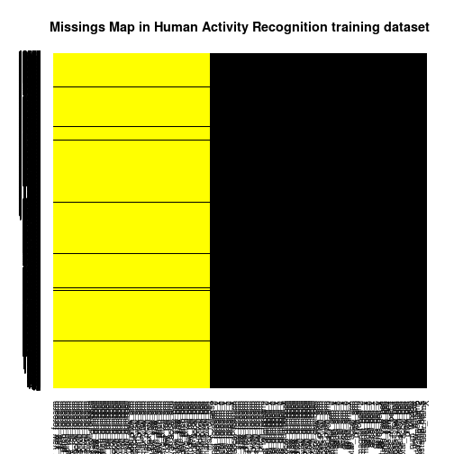
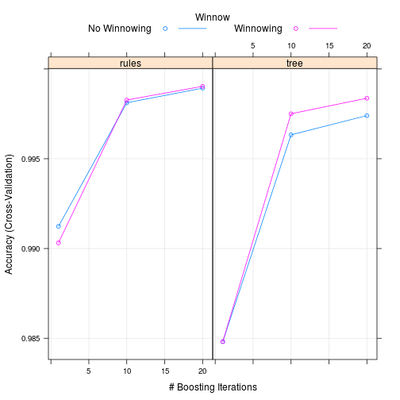

Prediction Assignment Writeup
========================================================
1. Libraries
----------------

```r
library(caret)
library(Amelia)
library(C50)
library(e1071)
```

2. Load the data
----------------

```r
training <- read.csv("pml-training.csv")
test <- read.csv("pml-testing.csv")
```

3. Clean the data
----------------
First remove the missing values

```r
missmap(training, main="Missings Map in Human Activity Recognition training dataset", col=c("yellow", "black"), legend=FALSE)
```

 

The majority of files contains missing values, and this missing values are in the same columns. To clean the dataset, the columns who has more than 10% of files with missing values are removed

```r
removedColumns <- names(training[colSums(is.na(training))>(0.1*nrow(training))])
cleanTraining <- training[!names(training)%in%removedColumns]
```

Now it is time to remove the files with missing values

```r
cleanTraining <- na.omit(cleanTraining)
```

In the dataset there are variables with near zero variance:

```r
summary(cleanTraining)
```

```
##        X            user_name    raw_timestamp_part_1 raw_timestamp_part_2
##  Min.   :    1   adelmo  :3892   Min.   :1.32e+09     Min.   :   294      
##  1st Qu.: 4906   carlitos:3112   1st Qu.:1.32e+09     1st Qu.:252912      
##  Median : 9812   charles :3536   Median :1.32e+09     Median :496380      
##  Mean   : 9812   eurico  :3070   Mean   :1.32e+09     Mean   :500656      
##  3rd Qu.:14717   jeremy  :3402   3rd Qu.:1.32e+09     3rd Qu.:751891      
##  Max.   :19622   pedro   :2610   Max.   :1.32e+09     Max.   :998801      
##                                                                           
##           cvtd_timestamp  new_window    num_window    roll_belt    
##  28/11/2011 14:14: 1498   no :19216   Min.   :  1   Min.   :-28.9  
##  05/12/2011 11:24: 1497   yes:  406   1st Qu.:222   1st Qu.:  1.1  
##  30/11/2011 17:11: 1440               Median :424   Median :113.0  
##  05/12/2011 11:25: 1425               Mean   :431   Mean   : 64.4  
##  02/12/2011 14:57: 1380               3rd Qu.:644   3rd Qu.:123.0  
##  02/12/2011 13:34: 1375               Max.   :864   Max.   :162.0  
##  (Other)         :11007                                            
##    pitch_belt        yaw_belt      total_accel_belt kurtosis_roll_belt
##  Min.   :-55.80   Min.   :-180.0   Min.   : 0.0              :19216   
##  1st Qu.:  1.76   1st Qu.: -88.3   1st Qu.: 3.0     #DIV/0!  :   10   
##  Median :  5.28   Median : -13.0   Median :17.0     -1.908453:    2   
##  Mean   :  0.31   Mean   : -11.2   Mean   :11.3     0.000673 :    1   
##  3rd Qu.: 14.90   3rd Qu.:  12.9   3rd Qu.:18.0     0.005503 :    1   
##  Max.   : 60.30   Max.   : 179.0   Max.   :29.0     -0.016850:    1   
##                                                     (Other)  :  391   
##  kurtosis_picth_belt kurtosis_yaw_belt skewness_roll_belt
##           :19216            :19216              :19216   
##  #DIV/0!  :   32     #DIV/0!:  406     #DIV/0!  :    9   
##  47.000000:    4                       0.000000 :    4   
##  -0.150950:    3                       0.422463 :    2   
##  -0.684748:    3                       0.000748 :    1   
##  11.094417:    3                       -0.003095:    1   
##  (Other)  :  361                       (Other)  :  389   
##  skewness_roll_belt.1 skewness_yaw_belt  max_yaw_belt    min_yaw_belt  
##           :19216             :19216            :19216          :19216  
##  #DIV/0!  :   32      #DIV/0!:  406     -1.1   :   30   -1.1   :   30  
##  0.000000 :    4                        -1.4   :   29   -1.4   :   29  
##  -2.156553:    3                        -1.2   :   26   -1.2   :   26  
##  -3.072669:    3                        -0.9   :   24   -0.9   :   24  
##  -6.324555:    3                        -1.3   :   22   -1.3   :   22  
##  (Other)  :  361                        (Other):  275   (Other):  275  
##  amplitude_yaw_belt  gyros_belt_x      gyros_belt_y      gyros_belt_z   
##         :19216      Min.   :-1.0400   Min.   :-0.6400   Min.   :-1.460  
##  0.00   :   12      1st Qu.:-0.0300   1st Qu.: 0.0000   1st Qu.:-0.200  
##  0.0000 :  384      Median : 0.0300   Median : 0.0200   Median :-0.100  
##  #DIV/0!:   10      Mean   :-0.0056   Mean   : 0.0396   Mean   :-0.131  
##                     3rd Qu.: 0.1100   3rd Qu.: 0.1100   3rd Qu.:-0.020  
##                     Max.   : 2.2200   Max.   : 0.6400   Max.   : 1.620  
##                                                                         
##   accel_belt_x      accel_belt_y    accel_belt_z    magnet_belt_x  
##  Min.   :-120.00   Min.   :-69.0   Min.   :-275.0   Min.   :-52.0  
##  1st Qu.: -21.00   1st Qu.:  3.0   1st Qu.:-162.0   1st Qu.:  9.0  
##  Median : -15.00   Median : 35.0   Median :-152.0   Median : 35.0  
##  Mean   :  -5.59   Mean   : 30.1   Mean   : -72.6   Mean   : 55.6  
##  3rd Qu.:  -5.00   3rd Qu.: 61.0   3rd Qu.:  27.0   3rd Qu.: 59.0  
##  Max.   :  85.00   Max.   :164.0   Max.   : 105.0   Max.   :485.0  
##                                                                    
##  magnet_belt_y magnet_belt_z     roll_arm        pitch_arm     
##  Min.   :354   Min.   :-623   Min.   :-180.0   Min.   :-88.80  
##  1st Qu.:581   1st Qu.:-375   1st Qu.: -31.8   1st Qu.:-25.90  
##  Median :601   Median :-320   Median :   0.0   Median :  0.00  
##  Mean   :594   Mean   :-346   Mean   :  17.8   Mean   : -4.61  
##  3rd Qu.:610   3rd Qu.:-306   3rd Qu.:  77.3   3rd Qu.: 11.20  
##  Max.   :673   Max.   : 293   Max.   : 180.0   Max.   : 88.50  
##                                                                
##     yaw_arm        total_accel_arm  gyros_arm_x      gyros_arm_y    
##  Min.   :-180.00   Min.   : 1.0    Min.   :-6.370   Min.   :-3.440  
##  1st Qu.: -43.10   1st Qu.:17.0    1st Qu.:-1.330   1st Qu.:-0.800  
##  Median :   0.00   Median :27.0    Median : 0.080   Median :-0.240  
##  Mean   :  -0.62   Mean   :25.5    Mean   : 0.043   Mean   :-0.257  
##  3rd Qu.:  45.88   3rd Qu.:33.0    3rd Qu.: 1.570   3rd Qu.: 0.140  
##  Max.   : 180.00   Max.   :66.0    Max.   : 4.870   Max.   : 2.840  
##                                                                     
##   gyros_arm_z     accel_arm_x      accel_arm_y      accel_arm_z    
##  Min.   :-2.33   Min.   :-404.0   Min.   :-318.0   Min.   :-636.0  
##  1st Qu.:-0.07   1st Qu.:-242.0   1st Qu.: -54.0   1st Qu.:-143.0  
##  Median : 0.23   Median : -44.0   Median :  14.0   Median : -47.0  
##  Mean   : 0.27   Mean   : -60.2   Mean   :  32.6   Mean   : -71.2  
##  3rd Qu.: 0.72   3rd Qu.:  84.0   3rd Qu.: 139.0   3rd Qu.:  23.0  
##  Max.   : 3.02   Max.   : 437.0   Max.   : 308.0   Max.   : 292.0  
##                                                                    
##   magnet_arm_x   magnet_arm_y   magnet_arm_z  kurtosis_roll_arm
##  Min.   :-584   Min.   :-392   Min.   :-597           :19216   
##  1st Qu.:-300   1st Qu.:  -9   1st Qu.: 131   #DIV/0! :   78   
##  Median : 289   Median : 202   Median : 444   0.01388 :    1   
##  Mean   : 192   Mean   : 157   Mean   : 306   0.01574 :    1   
##  3rd Qu.: 637   3rd Qu.: 323   3rd Qu.: 545   0.01619 :    1   
##  Max.   : 782   Max.   : 583   Max.   : 694   -0.02438:    1   
##                                               (Other) :  324   
##  kurtosis_picth_arm kurtosis_yaw_arm skewness_roll_arm skewness_pitch_arm
##          :19216             :19216           :19216            :19216    
##  #DIV/0! :   80     #DIV/0! :   11   #DIV/0! :   77    #DIV/0! :   80    
##  -0.00484:    1     0.55844 :    2   -0.00051:    1    0.00000 :    1    
##  0.00981 :    1     0.65132 :    2   0.00445 :    1    -0.00184:    1    
##  -0.01311:    1     -0.01548:    1   0.00494 :    1    0.00189 :    1    
##  -0.02967:    1     -0.01749:    1   0.00646 :    1    0.00708 :    1    
##  (Other) :  322     (Other) :  389   (Other) :  325    (Other) :  322    
##  skewness_yaw_arm roll_dumbbell    pitch_dumbbell    yaw_dumbbell    
##          :19216   Min.   :-153.7   Min.   :-149.6   Min.   :-150.87  
##  #DIV/0! :   11   1st Qu.: -18.5   1st Qu.: -40.9   1st Qu.: -77.64  
##  0.55053 :    2   Median :  48.2   Median : -21.0   Median :  -3.32  
##  -1.62032:    2   Mean   :  23.8   Mean   : -10.8   Mean   :   1.67  
##  0.00000 :    1   3rd Qu.:  67.6   3rd Qu.:  17.5   3rd Qu.:  79.64  
##  -0.00311:    1   Max.   : 153.6   Max.   : 149.4   Max.   : 154.95  
##  (Other) :  389                                                      
##  kurtosis_roll_dumbbell kurtosis_picth_dumbbell kurtosis_yaw_dumbbell
##         :19216                 :19216                  :19216        
##  #DIV/0!:    5          -0.5464:    2           #DIV/0!:  406        
##  -0.2583:    2          -0.9334:    2                                
##  -0.3705:    2          -2.0833:    2                                
##  -0.5855:    2          -2.0851:    2                                
##  -2.0851:    2          -2.0889:    2                                
##  (Other):  393          (Other):  396                                
##  skewness_roll_dumbbell skewness_pitch_dumbbell skewness_yaw_dumbbell
##         :19216                 :19216                  :19216        
##  #DIV/0!:    4          0.1090 :    2           #DIV/0!:  406        
##  0.1110 :    2          -0.2328:    2                                
##  -0.9324:    2          -0.3521:    2                                
##  1.0312 :    2          -0.7036:    2                                
##  0.0011 :    1          1.0326 :    2                                
##  (Other):  395          (Other):  396                                
##  max_yaw_dumbbell min_yaw_dumbbell amplitude_yaw_dumbbell
##         :19216           :19216           :19216         
##  -0.6   :   20    -0.6   :   20    0.00   :  401         
##  0.2    :   19    0.2    :   19    #DIV/0!:    5         
##  -0.8   :   18    -0.8   :   18                          
##  -0.3   :   16    -0.3   :   16                          
##  0.0    :   15    0.0    :   15                          
##  (Other):  318    (Other):  318                          
##  total_accel_dumbbell gyros_dumbbell_x  gyros_dumbbell_y gyros_dumbbell_z
##  Min.   : 0.0         Min.   :-204.00   Min.   :-2.10    Min.   : -2.4   
##  1st Qu.: 4.0         1st Qu.:  -0.03   1st Qu.:-0.14    1st Qu.: -0.3   
##  Median :10.0         Median :   0.13   Median : 0.03    Median : -0.1   
##  Mean   :13.7         Mean   :   0.16   Mean   : 0.05    Mean   : -0.1   
##  3rd Qu.:19.0         3rd Qu.:   0.35   3rd Qu.: 0.21    3rd Qu.:  0.0   
##  Max.   :58.0         Max.   :   2.22   Max.   :52.00    Max.   :317.0   
##                                                                          
##  accel_dumbbell_x accel_dumbbell_y accel_dumbbell_z magnet_dumbbell_x
##  Min.   :-419.0   Min.   :-189.0   Min.   :-334.0   Min.   :-643     
##  1st Qu.: -50.0   1st Qu.:  -8.0   1st Qu.:-142.0   1st Qu.:-535     
##  Median :  -8.0   Median :  41.5   Median :  -1.0   Median :-479     
##  Mean   : -28.6   Mean   :  52.6   Mean   : -38.3   Mean   :-328     
##  3rd Qu.:  11.0   3rd Qu.: 111.0   3rd Qu.:  38.0   3rd Qu.:-304     
##  Max.   : 235.0   Max.   : 315.0   Max.   : 318.0   Max.   : 592     
##                                                                      
##  magnet_dumbbell_y magnet_dumbbell_z  roll_forearm     pitch_forearm   
##  Min.   :-3600     Min.   :-262.0    Min.   :-180.00   Min.   :-72.50  
##  1st Qu.:  231     1st Qu.: -45.0    1st Qu.:  -0.74   1st Qu.:  0.00  
##  Median :  311     Median :  13.0    Median :  21.70   Median :  9.24  
##  Mean   :  221     Mean   :  46.1    Mean   :  33.83   Mean   : 10.71  
##  3rd Qu.:  390     3rd Qu.:  95.0    3rd Qu.: 140.00   3rd Qu.: 28.40  
##  Max.   :  633     Max.   : 452.0    Max.   : 180.00   Max.   : 89.80  
##                                                                        
##   yaw_forearm     kurtosis_roll_forearm kurtosis_picth_forearm
##  Min.   :-180.0          :19216                :19216         
##  1st Qu.: -68.6   #DIV/0!:   84         #DIV/0!:   85         
##  Median :   0.0   -0.8079:    2         0.0012 :    1         
##  Mean   :  19.2   -0.9169:    2         -0.0073:    1         
##  3rd Qu.: 110.0   0.0128 :    1         0.0249 :    1         
##  Max.   : 180.0   -0.0227:    1         0.0354 :    1         
##                   (Other):  316         (Other):  317         
##  kurtosis_yaw_forearm skewness_roll_forearm skewness_pitch_forearm
##         :19216               :19216                :19216         
##  #DIV/0!:  406        #DIV/0!:   83         #DIV/0!:   85         
##                       -0.1912:    2         0.0000 :    4         
##                       -0.4126:    2         -0.6992:    2         
##                       -0.0004:    1         -0.0113:    1         
##                       -0.0013:    1         -0.0131:    1         
##                       (Other):  317         (Other):  313         
##  skewness_yaw_forearm max_yaw_forearm min_yaw_forearm
##         :19216               :19216          :19216  
##  #DIV/0!:  406        #DIV/0!:   84   #DIV/0!:   84  
##                       -1.2   :   32   -1.2   :   32  
##                       -1.3   :   31   -1.3   :   31  
##                       -1.4   :   24   -1.4   :   24  
##                       -1.5   :   24   -1.5   :   24  
##                       (Other):  211   (Other):  211  
##  amplitude_yaw_forearm total_accel_forearm gyros_forearm_x  
##         :19216         Min.   :  0.0       Min.   :-22.000  
##  0.00   :  322         1st Qu.: 29.0       1st Qu.: -0.220  
##  #DIV/0!:   84         Median : 36.0       Median :  0.050  
##                        Mean   : 34.7       Mean   :  0.158  
##                        3rd Qu.: 41.0       3rd Qu.:  0.560  
##                        Max.   :108.0       Max.   :  3.970  
##                                                             
##  gyros_forearm_y  gyros_forearm_z  accel_forearm_x  accel_forearm_y
##  Min.   : -7.02   Min.   : -8.09   Min.   :-498.0   Min.   :-632   
##  1st Qu.: -1.46   1st Qu.: -0.18   1st Qu.:-178.0   1st Qu.:  57   
##  Median :  0.03   Median :  0.08   Median : -57.0   Median : 201   
##  Mean   :  0.08   Mean   :  0.15   Mean   : -61.7   Mean   : 164   
##  3rd Qu.:  1.62   3rd Qu.:  0.49   3rd Qu.:  76.0   3rd Qu.: 312   
##  Max.   :311.00   Max.   :231.00   Max.   : 477.0   Max.   : 923   
##                                                                    
##  accel_forearm_z  magnet_forearm_x magnet_forearm_y magnet_forearm_z
##  Min.   :-446.0   Min.   :-1280    Min.   :-896     Min.   :-973    
##  1st Qu.:-182.0   1st Qu.: -616    1st Qu.:   2     1st Qu.: 191    
##  Median : -39.0   Median : -378    Median : 591     Median : 511    
##  Mean   : -55.3   Mean   : -313    Mean   : 380     Mean   : 394    
##  3rd Qu.:  26.0   3rd Qu.:  -73    3rd Qu.: 737     3rd Qu.: 653    
##  Max.   : 291.0   Max.   :  672    Max.   :1480     Max.   :1090    
##                                                                     
##  classe  
##  A:5580  
##  B:3797  
##  C:3422  
##  D:3216  
##  E:3607  
##          
## 
```

It is time to remove the variables with near zero variance

```r
cleanTrainingNZV <- nearZeroVar(cleanTraining, saveMetrics=TRUE)
removedColumns <- c(removedColumns, rownames(cleanTrainingNZV[cleanTrainingNZV$nzv==TRUE,]))
cleanTraining <- cleanTraining[!names(cleanTraining)%in%removedColumns]
```

Finally the non-numbers are removed

```r
nonNumericCleanTraining <- names(cleanTraining[!sapply(cleanTraining, is.numeric)])
nonNumericCleanTraining <- nonNumericCleanTraining[nonNumericCleanTraining!="classe"]
removedColumns <- c(removedColumns, nonNumericCleanTraining)
cleanTraining <- cleanTraining[!names(cleanTraining)%in%removedColumns]
```

4. Trainning
----------------
Cross validation is used to train the model with 3 folds:

```r
fitControl <- trainControl(method = "cv", number = 3)
```

Train the model

```r
set.seed(1)
md <- train(classe ~ ., data = cleanTraining, method = "C5.0", trControl=fitControl, importance=TRUE)
```

The importance of variables is check

```r
varImp(md$finalModel, scale=FALSE)
```

```
##                      Overall
## X                        100
## raw_timestamp_part_1       0
## raw_timestamp_part_2       0
## num_window                 0
## roll_belt                  0
## pitch_belt                 0
## yaw_belt                   0
## total_accel_belt           0
## gyros_belt_x               0
## gyros_belt_y               0
## gyros_belt_z               0
## accel_belt_x               0
## accel_belt_y               0
## accel_belt_z               0
## magnet_belt_x              0
## magnet_belt_y              0
## magnet_belt_z              0
## roll_arm                   0
## pitch_arm                  0
## yaw_arm                    0
## total_accel_arm            0
## gyros_arm_x                0
## gyros_arm_y                0
## gyros_arm_z                0
## accel_arm_x                0
## accel_arm_y                0
## accel_arm_z                0
## magnet_arm_x               0
## magnet_arm_y               0
## magnet_arm_z               0
## roll_dumbbell              0
## pitch_dumbbell             0
## yaw_dumbbell               0
## total_accel_dumbbell       0
## gyros_dumbbell_x           0
## gyros_dumbbell_y           0
## gyros_dumbbell_z           0
## accel_dumbbell_x           0
## accel_dumbbell_y           0
## accel_dumbbell_z           0
## magnet_dumbbell_x          0
## magnet_dumbbell_y          0
## magnet_dumbbell_z          0
## roll_forearm               0
## pitch_forearm              0
## yaw_forearm                0
## total_accel_forearm        0
## gyros_forearm_x            0
## gyros_forearm_y            0
## gyros_forearm_z            0
## accel_forearm_x            0
## accel_forearm_y            0
## accel_forearm_z            0
## magnet_forearm_x           0
## magnet_forearm_y           0
## magnet_forearm_z           0
```

The model is overfitting for the X variable. This variable is removed and the model is created again:

```r
removedColumns <- c(removedColumns, "X")
cleanTraining <- cleanTraining[!names(cleanTraining)%in%removedColumns]
set.seed(1)
md <- train(classe ~ ., data = cleanTraining, method = "C5.0", trControl=fitControl, importance=TRUE)
```

The importance of variables is check again:

```r
varImp(md$finalModel, scale=FALSE)
```

```
##                      Overall
## num_window            100.00
## roll_belt             100.00
## gyros_belt_z          100.00
## magnet_belt_y         100.00
## accel_dumbbell_x      100.00
## pitch_forearm         100.00
## pitch_belt             99.65
## magnet_belt_z          99.23
## yaw_belt               99.18
## yaw_arm                98.78
## gyros_belt_y           98.53
## raw_timestamp_part_1   98.37
## magnet_dumbbell_z      96.35
## accel_dumbbell_z       94.67
## accel_belt_z           94.20
## magnet_forearm_y       92.80
## magnet_dumbbell_y      92.20
## gyros_dumbbell_y       90.34
## pitch_arm              88.87
## magnet_arm_z           86.14
## magnet_forearm_z       85.81
## magnet_belt_x          84.49
## accel_belt_y           83.93
## accel_forearm_z        83.83
## accel_forearm_x        83.39
## accel_dumbbell_y       83.04
## gyros_dumbbell_z       80.58
## magnet_dumbbell_x      79.99
## roll_forearm           74.51
## gyros_arm_x            62.26
## total_accel_dumbbell   58.07
## yaw_dumbbell           57.78
## gyros_arm_y            57.70
## gyros_belt_x           57.06
## total_accel_arm        51.68
## accel_arm_x            51.44
## gyros_forearm_x        50.47
## roll_dumbbell          49.76
## gyros_forearm_z        47.61
## gyros_dumbbell_x       44.58
## magnet_arm_y           42.73
## magnet_forearm_x       40.84
## yaw_forearm            37.49
## accel_arm_z            26.92
## total_accel_belt       22.38
## raw_timestamp_part_2   18.90
## gyros_arm_z            14.43
## accel_belt_x            0.00
## roll_arm                0.00
## accel_arm_y             0.00
## magnet_arm_x            0.00
## pitch_dumbbell          0.00
## total_accel_forearm     0.00
## gyros_forearm_y         0.00
## accel_forearm_y         0.00
```

5. The sample error is analyzed
----------------

```r
md
```

```
## C5.0 
## 
## 19622 samples
##    55 predictors
##     5 classes: 'A', 'B', 'C', 'D', 'E' 
## 
## No pre-processing
## Resampling: Cross-Validated (3 fold) 
## 
## Summary of sample sizes: 13080, 13081, 13083 
## 
## Resampling results across tuning parameters:
## 
##   model  winnow  trials  Accuracy  Kappa   Accuracy SD  Kappa SD 
##   rules  FALSE    1      0.9912    0.9889  3.077e-03    3.892e-03
##   rules  FALSE   10      0.9981    0.9976  4.913e-04    6.216e-04
##   rules  FALSE   20      0.9989    0.9986  2.500e-07    3.453e-07
##   rules   TRUE    1      0.9903    0.9878  7.041e-04    8.920e-04
##   rules   TRUE   10      0.9983    0.9978  4.410e-04    5.578e-04
##   rules   TRUE   20      0.9990    0.9988  2.334e-04    2.953e-04
##   tree   FALSE    1      0.9848    0.9808  7.103e-03    8.982e-03
##   tree   FALSE   10      0.9963    0.9954  1.551e-03    1.962e-03
##   tree   FALSE   20      0.9974    0.9967  5.507e-04    6.965e-04
##   tree    TRUE    1      0.9848    0.9808  4.989e-03    6.309e-03
##   tree    TRUE   10      0.9975    0.9968  8.822e-04    1.116e-03
##   tree    TRUE   20      0.9984    0.9979  3.181e-04    4.024e-04
## 
## Accuracy was used to select the optimal model using  the largest value.
## The final values used for the model were trials = 20, model = rules
##  and winnow = TRUE.
```

```r
plot(md, metric="Accuracy")
```

 
The acuraccy and kappa is higth, it is possible overfiting in the model

6. Prediction in test dataset
----------------
Remove the columns removed in training dataset (for missing values, for near zero variance or for casuse overfitting):

```r
cleanTesting <- test[!names(test)%in%removedColumns]
```

Remove the files with missing values

```r
cleanTesting <- na.omit(cleanTesting)
```

A prediction of the test set is obtained

```r
predictionTest <- predict(md, cleanTesting)
predictionTest
```

```
##  [1] B A B A A E D B A A B C B A E E A B B B
## Levels: A B C D E
```

Create the solutions files:

```r
pml_write_files = function(x){
  n = length(x)
  for(i in 1:n){
    filename = paste0("problem_id_",i,".txt")
    write.table(x[i],file=filename,quote=FALSE,row.names=FALSE,col.names=FALSE)
  }
}

pml_write_files(predictionTest)
```

7. score of solutions
----------------
100% (20/20)

